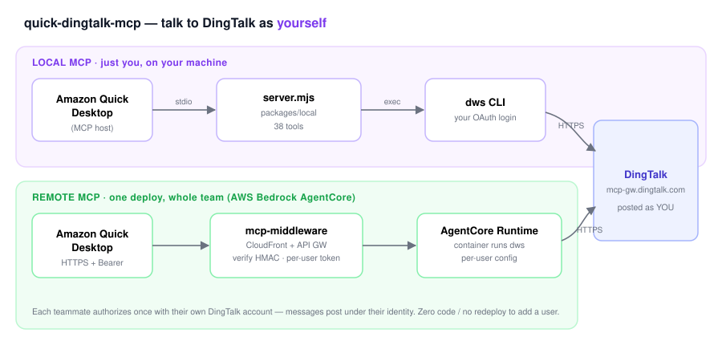
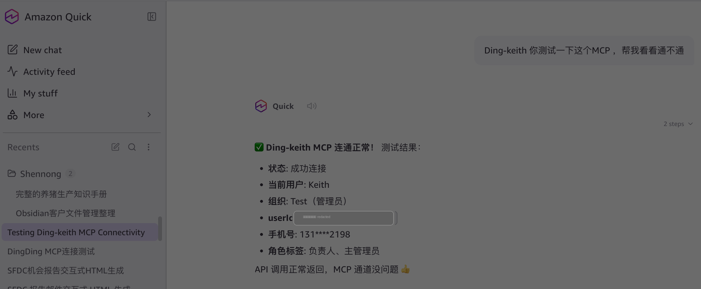

# quick-dingtalk-mcp

> **Talk to DingTalk as *yourself* — from Amazon Quick Desktop and any other MCP host.**

An MCP server that wraps DingTalk's official CLI ([`dws`](https://github.com/DingTalk-Real-AI/dingtalk-workspace-cli)) so an AI assistant can send and read DingTalk messages **with your real user identity** — your avatar, your name in the group — instead of posting as a bot.

[](./LICENSE)
[](https://modelcontextprotocol.io)

English · [中文](./README_CN.md)

<p align="center">
  
</p>

---

## Why this exists

DingTalk's own MCP server ([`open-dingtalk/dingtalk-mcp`](https://github.com/open-dingtalk/dingtalk-mcp)) only speaks as a **bot** — your teammates see a robot talking in the group, not you. That's wrong for a personal assistant.

This project takes the opposite route. It wraps `dws`, DingTalk's official CLI, which authenticates over **user-identity OAuth**. So when you tell your assistant *"post 'meeting moved to 3pm' in the project group"*, the message lands **authored by you** — exactly as if you'd typed it.

`dws` is itself a thin client to DingTalk's MCP gateway (`mcp-gw.dingtalk.com`), meaning DingTalk's backend is already MCP-native. This project exposes that capability in two ways:

| | **Local MCP** | **Remote MCP** |
|---|---|---|
| Who it's for | Just you, on your own machine | A whole team, shared |
| Runs where | `dws` on your laptop, stdio to the host | AWS Bedrock AgentCore + Lambda, HTTPS |
| Setup | `npm install` + `dws auth login` (~5 min) | Admin deploys once; each teammate self-authorizes |
| Identity | Your own logged-in `dws` session | Per-user OAuth, isolated per teammate |
| Best when | Personal use, fastest start | Many users, central audit, no local install |

Both expose the **same 38 tools** (see [Tools](#tools)) backed by the same shared command catalog.

---

## Local MCP

Run it on your own machine and wire it into Amazon Quick Desktop (or Claude Desktop, Cursor) over stdio.

```
You type            Amazon Quick Desktop          quick-dingtalk-mcp              dws CLI                 DingTalk
"post in X group" ──→  (MCP host) ──stdio──→ node packages/local/server.mjs ──exec──→ dws chat ... ──HTTPS──→ mcp-gw.dingtalk.com
```

### 1. Install the DingTalk CLI

```bash
npm install -g dingtalk-workspace-cli
```

> Your DingTalk org must have **CLI access** enabled. Admins: [open-dev.dingtalk.com](https://open-dev.dingtalk.com) → "CLI 访问管理" → enable (once, org-wide). Members hitting a not-enabled wall get a one-click request prompt at login.

### 2. Get the project

```bash
git clone https://github.com/keithyt06/quick-dingtalk-mcp.git
cd quick-dingtalk-mcp
npm install
```

### 3. Log in to DingTalk (as you)

```bash
dws auth login --device      # device flow — works over SSH / headless too
```

Scan the code with your DingTalk app to authorize. This is the step that makes messages post **as you**.

### 4. Connect Amazon Quick Desktop

First grab two absolute paths (Quick Desktop's child process doesn't inherit your full `PATH`, so absolute paths are the reliable choice — and **no spaces** in the path):

```bash
which node                                  # e.g. /opt/homebrew/bin/node
echo "$(pwd)/packages/local/server.mjs"     # the server entrypoint
```

Then in **Amazon Quick Desktop → Settings → Capabilities → MCP → + Add MCP**:

| Field | Value |
|---|---|
| Connection type | **Local** |
| ID | `quick-dingtalk-mcp` |
| Name | `quick-dingtalk-mcp` |
| Command | the `which node` path |
| Arguments | the `server.mjs` absolute path |

Save. You should see **`quick-dingtalk-mcp · 38 tools · Connected ✅`**.

Once connected, asking it to look you up returns your real DingTalk identity — proof the chain works end to end:

<p align="center">
  
</p>

### 5. Try it

In a Quick Desktop chat:

```
List my recent DingTalk chats, then post a markdown message titled "test"
with body "hello from quick-dingtalk-mcp" to chat_id=cidXXXX.
```

Full walkthrough (incl. Claude Desktop / Cursor, troubleshooting, the "is it really *me*?" verification) → **[packages/local/docs/setup.md](./packages/local/docs/setup.md)**

---

## Remote MCP

A shared, multi-user deployment on AWS Bedrock AgentCore. **One deploy serves any number of teammates** — onboarding a new person is self-service, with zero code changes and no redeploy.

```
Each teammate           Amazon Quick Desktop                 AWS
authorizes once  ──→  (MCP host, HTTPS + Bearer) ──→ CloudFront → API GW → mcp-middleware (Lambda)
                                                          │  verify HMAC token, load *this user's* DingTalk token
                                                          ▼
                                                   AgentCore Runtime (container running dws, per-user config)
                                                          │
                                                          ▼
                                                       DingTalk  (authored by that teammate)
```

Each teammate's DingTalk token is stored, KMS-encrypted, per `userId` in Secrets Manager; the container gives each user an isolated `dws` config. Tokens auto-refresh on a schedule, and the MCP token you paste into your client stays valid as long as you keep using it — the backend tracks a per-user activity window (90 days idle before re-auth is needed), so a one-time setup just keeps working.

### Admin: deploy once

```bash
curl -fsSL https://raw.githubusercontent.com/keithyt06/quick-dingtalk-mcp/main/packages/remote/scripts/install.sh | bash
~/.quick-dingtalk-mcp/packages/remote/scripts/deploy.sh
```

`deploy.sh` provisions everything (CloudFront, API Gateway, Lambdas, DynamoDB, Secrets Manager, the AgentCore Runtime container) and prints:
- the **authorize URL** to hand to teammates
- the **MCP endpoint** (`https://<domain>/mcp`) they paste into Amazon Quick Desktop

> Prereqs: a DingTalk app (AppKey/AppSecret) with `<domain>/callback` registered as its redirect URL, AWS creds for `us-east-1`, Docker, and Node ≥ 22.6. See [docs/remote-operations.md](./docs/remote-operations.md).

### Teammate: connect Amazon Quick Desktop

The gateway is a standard **OAuth 2.1 Authorization Server** (PKCE + dynamic client registration), so there are two ways in:

**Recommended — OAuth wizard (no token copying):** in Quick's MCP connector, choose OAuth and fill `Authorization URL = https://<domain>/authorize`, `Token URL = https://<domain>/token`, `MCP Endpoint = https://<domain>/mcp`, `Scope = openid` (Client ID/Secret: any non-empty placeholder — PKCE is what's checked, the secret isn't). Quick then pops a login button, you approve with *your* DingTalk account, and it wires up the token automatically. Access tokens are short-lived and Quick **auto-refreshes** them — you authorize once and never touch a token.

**Fallback — manual Bearer:** for hosts without an OAuth wizard, open `https://<domain>/authorize` in a browser, approve with your DingTalk account, copy the `Bearer ...` it returns into the connector's `Authorization` header (`Connection type: Remote / HTTP`, `streamable-http`, `URL = https://<domain>/mcp`). Valid long-term as long as you keep using it (re-auth only after 90 days idle).

Then **verify** — say *"use dingtalk to look up my own profile"*; it returns your real org/department. You never touch the DingTalk developer console — the app is the admin's; you just authorize with your account.

Full onboarding + troubleshooting → **[docs/remote-quick-desktop.md](./docs/remote-quick-desktop.md)**

---

## Tools

38 tools, identical across Local and Remote, backed by a shared catalog that covers **all 261 `dws` commands**:

| Group | Count | What |
|---|---|---|
| **Named tools** | 30 | The common ones, exposed directly: `dingtalk_chat_message_send` / `_list` / `_search` / `_recall` / `_reply` / `_forward`, `dingtalk_contact_user_search` / `_get_self`, `dingtalk_calendar_event_create`, `dingtalk_doc_create` / `_read`, `dingtalk_todo_task_create`, `dingtalk_ding_message_send`, … |
| **Discover + invoke** | 2 | `dingtalk_discover` (keyword-search the full catalog) + `dingtalk_invoke` (run anything it returns) — reaches all 261 commands without bloating the tool list |
| **Aliases** | 6 | Older names kept working, marked `[deprecated, use …]` |

Covers IM, contacts, calendar, docs/drive, todo, DING, attendance, OA approval, AI table, minutes, mail, and more. Every DingTalk message requires a **title** (unlike Feishu) — the catalog enforces it.

---

## Comparison

| | **This project** | [`open-dingtalk/dingtalk-mcp`](https://github.com/open-dingtalk/dingtalk-mcp) | Custom robot webhook |
|---|---|---|---|
| Posts as | **You** (real user) | A bot | A robot |
| Auth | User OAuth (`dws`) | App credentials | Webhook URL |
| Read history / search | ✅ | ❌ / limited | ❌ |
| Group display | Your avatar + name | Bot | Robot name |

Want the assistant to *be you*? Use this. Want clearly-labelled automation? Use the bot/webhook routes.

---

## Docs

- **Local**: [setup](./packages/local/docs/setup.md) · [identity verification](./packages/local/docs/verification.md)
- **Remote**: [first-time setup · OAuth wizard, recommended (中文)](./docs/remote-新人首配-oauth.md) · [connect help · manual (中文)](./docs/remote-连接帮助.md) · [Quick Desktop onboarding](./docs/remote-quick-desktop.md) · [security](./docs/remote-security.md) · [operations](./docs/remote-operations.md) · [observability](./docs/remote-observability.md) · [FAQ](./docs/remote-faq.md) · [cost](./docs/remote-cost.md)

## Acknowledgments

- [`dws` — DingTalk-Real-AI/dingtalk-workspace-cli](https://github.com/DingTalk-Real-AI/dingtalk-workspace-cli) — does the heavy lifting; this project is a thin shim over it.
- [`@modelcontextprotocol/sdk`](https://www.npmjs.com/package/@modelcontextprotocol/sdk)
- Inspired by the `lark-cli-mcp` pattern for Feishu.

## License

[MIT](./LICENSE) © Keith Yu
