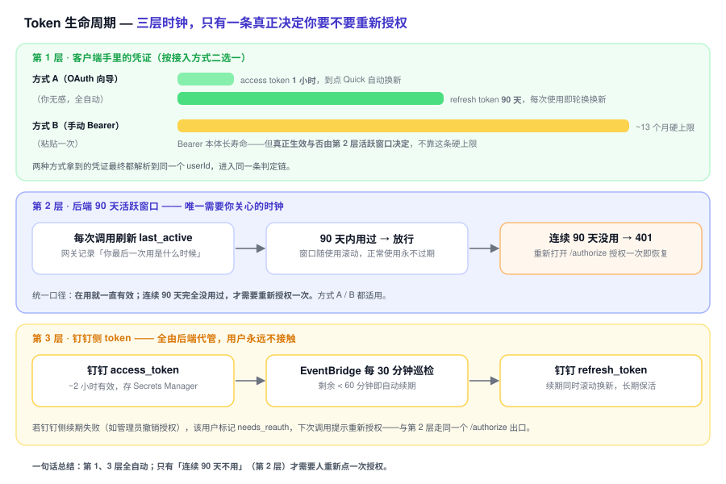
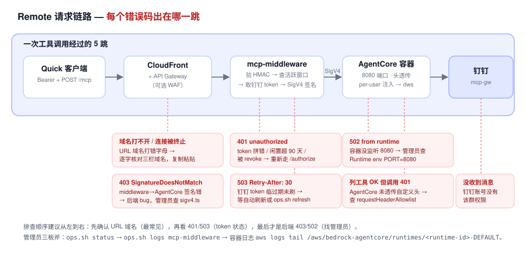

# Remote 端 Quick Desktop 接入指南（多用户）

> v0.2 Remote 多用户 HTTPS MCP 接入 Quick Desktop（钉钉）的完整流程。
> 方式 B（手动复制 Bearer）基于 2026-06-01 的真实部署 + 端到端联调实测；方式 A（标准 OAuth 向导）于 2026-06-10 在真实 Quick 实测通过。
>
> 📘 **只是想连上用、不关心技术细节？** 看面向新人的 [连接帮助](./remote-连接帮助.md)（含「连接失效怎么重连」）。本文是技术版，含传输协议、故障排查矩阵、Local/Remote 并存等。

## 核心模型：一次部署，多人自助

Remote 的设计目标是**一次部署支持任意多个员工**，新员工接入**不需要改代码、不需要重新部署、管理员几乎零介入**：

```
管理员（一次性）        每个员工（自助，~2 分钟）
─────────────────      ──────────────────────────
部署 1 套栈        ┐
注册 1 个钉钉应用   ├──→  浏览器打开 AuthorizeUrl
拿到 CloudFront 域名 ┘         ↓ 钉钉同意页（用自己的钉钉账号）
                              ↓ 复制返回的 Bearer token
                          粘进自己的 Quick Desktop
                              ↓
                          以"本人身份"操作钉钉
```

每个员工的钉钉 token 按 `userId` 独立加密存放在 Secrets Manager（`quick-dingtalk-mcp/users/<userId>`），容器为每个用户开独立的 `DWS_CONFIG_DIR`。**新增一个员工 = 多一条 Secrets Manager 记录，纯数据，不动任何代码或部署。**

---

## 两种接入方式：标准 OAuth（推荐）vs 手动复制 token

网关同时是一个标准 **OAuth 2.1 Authorization Server**（RFC 8414/9728/7591 + PKCE），所以有两条接入路径：

| | **标准 OAuth 向导（推荐）** | **手动复制 Bearer（fallback）** |
|---|---|---|
| 怎么配 | 在 Quick 填 Authorization/Token URL，**向导自动跳钉钉授权并回填 token** | 浏览器打开 `/authorize`，手动复制返回的 `Bearer` 粘进 header |
| 续期 | Quick 用 `refresh_token` **自动续**（access 1h，refresh 90天轮换） | token ~13 个月硬上限 + 后端 90 天活跃窗口 |
| 适合 | Quick 等支持 OAuth 向导的 host | 不支持自动 OAuth 的 host、调试、curl |

**优先用标准 OAuth**（下面「方式 A」）；host 不支持时再用「方式 B」手动流。两者颁发的都是同一种 MCP token，后端无差别。

> 上表「13 个月硬上限」是 HMAC 派生 token 的理论寿命上限，**用户无感**：只要 90 天内用过，后端会在到期前持续续期覆盖。对终端用户的统一口径就是「在用就长期有效，连续 90 天没用才需重连」——README 与新人文档按这个口径表述，本技术版额外把底层上限写出来仅供运维参考。

### 方式 A：标准 OAuth 向导（推荐，2026-06-10 在真实 Quick 实测通过）

> ⚠️ **入口**：从 Quick 的 **Connectors（连接器）→ Add connector → MCP** 进，认证方式选 **User authentication**。**别从 Settings → MCP 进**——那条路被当成无认证，401 后不会发起 OAuth discovery（日志只见 `/mcp`、不见 `/authorize`）。

在该连接器配置里填：

| 字段 | 值 |
|---|---|
| MCP server endpoint | `https://<域名>/mcp` |
| Network / 连接类型 | `Public network` |
| Authorization URL | `https://<域名>/authorize` |
| Token URL | `https://<域名>/token` |
| Client ID | `quick`（**必须正好填这个**——见下方说明） |
| Client Secret | 任意非空占位串，如 `placeholder`（网关用 PKCE 鉴权，**不校验 secret**；Quick 表单强制要才填） |
| Scope | `openid` |

> ⚠️ **三栏域名逐字一致**：MCP endpoint / Authorization URL / Token URL 的域名必须完全相同。实测踩坑：把 `d512ohnwy06c3` 的 `y` 手打成 `v`，授权页直接"意外终止连接"。**强烈建议复制粘贴**。

**为什么 Client ID 是固定的 `quick` 而不是留空走 DCR**：实测 Quick 的 User authentication 表单**强制要求 Client ID/Secret，且不会自动调 `/register` 做动态客户端注册（DCR）**——它直接拿你填的 Client ID 去打 `/authorize`。因此网关侧必须**预注册一个固定客户端**，本部署预注册的 ID 就是 `quick`（管理员准备见文末附录）。填错或留空会报 `{"error":"invalid_client","error_description":"unknown client_id"}`。

保存后 Quick 会：①弹出登录按钮 → ②你用**自己的钉钉账号**授权 → ③Quick 自动拿到 token 并连上，显示 **38 个工具**。**全程不用手动复制任何 token**，过期了 Quick 自己用 refresh_token 续。

> per-user 隔离要点：每个成员各自在自己的 Quick 里走这套 OAuth、用各自的钉钉账号授权，token 按 `userId` 隔离存放；切勿用「管理员授权一次全员复用」的共享凭据模式（会导致所有人共用管理员身份）。

### 方式 B：手动复制 Bearer（fallback）

host 不支持 OAuth 向导时，走下面「员工接入：3 步」的手动流——浏览器打开 `/authorize`（不带 OAuth 参数），页面会返回一段长效 `Bearer` 让你复制粘贴。

---

## 前置条件

| 角色 | 条件 | 说明 |
|---|---|---|
| 管理员 | 已跑过 `bash packages/remote/scripts/deploy.sh` | 拿到 CloudFront 域名（形如 `https://xxxxx.cloudfront.net`） |
| 管理员 | 钉钉开放平台建了一个企业内部应用 | 拿到 AppKey/AppSecret，并把 `<域名>/callback` 注册进应用的「安全设置 → 重定向 URL」 |
| 员工 | 有公司钉钉账号 | 不需要任何 AppKey/Secret，不需要碰钉钉开放平台 |
| 员工 | Quick Desktop ≥ 0.9.x | 支持 streamable-http transport + 自定义 `Authorization` header |

> 员工侧**完全不需要在钉钉开放平台做任何配置**——应用是管理员统一建的，员工只是用自己的钉钉账号去授权。

---

## 员工接入（方式 B：手动复制）：3 步

> 这是 **fallback 路径**。host 支持 OAuth 向导时优先用上面的「方式 A」，可免去手动复制 + 自动续期。

假设管理员给你的 CloudFront 域名是 `https://d512ohnwy06c3.cloudfront.net`（换成你们实际的）。

### 第 1 步：浏览器授权，拿到你自己的 token

在浏览器打开（管理员会把这个 AuthorizeUrl 发给你）：

```
https://<域名>/authorize
```

流程（你视角）：
1. 页面自动跳转到钉钉授权页。
2. 用**你自己的钉钉账号**确认授权（同意 scope `openid corpid`）。
3. 钉钉跳回，页面显示一段 `Bearer ...` token——**复制它**（这就是你的专属 MCP token，长期有效——只要在用就不过期）。

> 底层：`token-refresh-shim` Lambda 生成 `state`（写 DynamoDB，TTL 5 分钟）重定向到钉钉；钉钉回调后 Lambda 用授权码换 `access_token`+`refresh_token` 存进 Secrets Manager（KMS 加密），再用 SSM 里的 HMAC 主密钥派生出你的 MCP token（HMAC-SHA256，~13 个月硬上限；实际有效性由后端 90 天活跃窗口判定——只要 90 天内用过就持续续期）渲染到页面。

### 第 2 步：填进 Quick Desktop

Quick Desktop → Settings → MCP → + Add MCP，填：

| 字段 | 值 |
|---|---|
| Connection type / transport | **Remote / HTTP**（`streamable-http`） |
| Name | 任意，如 `钉钉 (Remote)` |
| URL | `https://<域名>/mcp`（**必须以 `/mcp` 结尾**） |
| Header | `Authorization: Bearer <第1步复制的 token>` |
| Timeout (seconds) | `300`（**单位是秒，最大 300**；该项是「等待 server 启动的最长时间 5-300s」，调大可防长工具超时） |

JSON 形式：

```json
{
  "name": "钉钉 (Remote)",
  "transport": "streamable-http",
  "url": "https://<域名>/mcp",
  "headers": {
    "Authorization": "Bearer <你的 token>"
  },
  "timeout": 300
}
```

保存后状态应变为 **Connected**，并显示 **38 个工具**。如果停在 "Configured" 不 Connected，见下文「故障排查」。

### 第 3 步：验证

在 Quick 对话里说：

```
用 dingtalk 查一下我自己的钉钉账号信息
```

应返回你本人的企业/部门信息（证明"以你身份"链路通）。再试发消息（需要群的 chat_id）：

```
用 dingtalk 给群 chat_id=cidXXXX 发条 markdown，标题"测试"，正文"remote 链路通了"
```

消息会以**你本人的头像和昵称**出现在群里。

---

## token 过期处理

系统里有三层 token 时钟，但只有「90 天活跃窗口」一条需要用户关心——其余全部由客户端或后端自动续：



| 情况 | 表象 | 处理 |
|---|---|---|
| 闲置 90 天后 MCP token 失效 | Quick 报 401 / 连接失效（极罕见） | 重新打开 `<域名>/authorize` 走一遍授权，复制新 token 替换 |
| 钉钉 access_token 临过期 | 偶发 503 `Retry-After: 30` | 后端 EventBridge 每 30 分钟自动用 refresh_token 续期，等一会重试即可；持续 503 找管理员跑 `ops.sh refresh` |
| 钉钉 refresh_token 失效（约 30 天未用） | 401 reauth | 必须重新走授权 URL |

> **重点**：钉钉侧的 access_token 由后端自动保活（EventBridge 定时刷新），MCP token 也只要你在用就长期有效。正常情况下你**配一次就一直能用**，不需要反复重新授权；只有连续 90 天完全没用过才需要重复第 1 步。

---

## 切换 / 并存 Local 与 Remote

Quick 支持同时挂多个 MCP server：

```json
{
  "mcpServers": {
    "dingtalk-local":  { "command": "node", "args": ["packages/local/server.mjs"] },
    "dingtalk-remote": { "transport": "streamable-http", "url": "https://<域名>/mcp", "headers": {"Authorization": "Bearer ..."} }
  }
}
```

- 个人本机用、不想走云 → Local。
- 多人共享、要审计留痕（DDB 记录） → Remote。
- 两个都挂时给不同 `name`，Quick 在路由层区分。

---

## 故障排查矩阵

先按图定位错误码出在链路的哪一跳，再查下表对应行：



| 现象 | 可能原因 | 定位 / 处理 |
|---|---|---|
| Quick 停在 "Configured" 不 Connected、0 tools | ① token 过期返回 503；② 协议握手不匹配（旧版后端） | 先重新授权拿新 token；仍不行让管理员确认后端已部署最新 server（带 `Mcp-Session-Id` 头 + 协议版本协商 + 通知 202） |
| 401 unauthorized | token 拼错 / HMAC 密钥被轮换 / token 过期 | 重新走授权 URL |
| 503 `Retry-After: 30`，body `token-near-expiry` | 钉钉 access_token < 60s 过期且未刷 | 等 EventBridge 刷新（≤30 分钟），或管理员 `ops.sh refresh`；**若长期 503，检查 token-refresh-shim 角色是否有 `secretsmanager:ListSecrets`（Resource:*）权限** |
| 403 SignatureDoesNotMatch | mcp-middleware → AgentCore 的 SigV4 签名问题 | 后端 bug，管理员查 `sigv4.ts`（path 不能含 query；ARN 走默认 uriEscapePath） |
| 502 from runtime | 容器没监听 8080 | 管理员确认 AgentCore Runtime env `PORT=8080`（AgentCore HTTP 契约强制） |
| 工具能列出但调用 401 | AgentCore 未透传自定义头 | 管理员确认 Runtime `requestHeaderAllowlist` 含 `x-user-id,x-user-access-token,x-incr-auth-token` |
| 钉钉端没收到消息 | 你的钉钉账号没那个群的权限 | 先在钉钉里被加进该群 |

管理员排查三板斧：
1. `bash packages/remote/scripts/ops.sh status` —— 看栈健康。
2. `bash packages/remote/scripts/ops.sh logs mcp-middleware` —— 看请求是否到网关、HMAC 校验、token 状态。
3. `aws logs tail /aws/bedrock-agentcore/runtimes/<runtime-id>-DEFAULT --follow --region us-east-1` —— 看容器内 dws 调用。

---

## 管理员：给新员工开通的最小动作

实际上**没有"开通"动作**——员工自助即可。管理员只需：

1. 把 **AuthorizeUrl**（`https://<域名>/authorize`）和本文档发给员工。
2. （仅当员工要用某些组织级接口时）在钉钉开放平台给应用补充对应 scope 权限。

无需在 AWS 侧为每个员工建任何资源——员工首次授权时 `token-refresh-shim` 会自动为其创建 Secrets Manager 记录。

---

## 附录：方式 A 的 `quick` 客户端预注册（deploy.sh 已自动化）

因为 Quick 的 User authentication 不跑 DCR、直接用填入的 Client ID 打 `/authorize`，网关侧需预注册一个固定客户端，成员才能填 `quick` 连上。缺这条记录时，成员填 `quick` 会报 `unknown client_id`。

**`deploy.sh` 每次部署会自动 upsert 这条 `client#quick` 记录**（无 `ttl` 属性，永不过期），回调白名单默认 `https://us-east-1.quicksight.aws.amazon.com/sn/oauthcallback`；你们 Quick 端点在其他 region/域名时，用环境变量覆盖后重跑部署：

```bash
QUICK_REDIRECT_URIS="https://<region>.quicksight.aws.amazon.com/sn/oauthcallback" \
  bash packages/remote/scripts/deploy.sh
```

（多个回调用逗号分隔。成员报 `redirect_uri not in registered allowlist` 时，把报错里的回调地址加进来重跑即可。）

> 验证：构造 `GET /authorize?client_id=quick&redirect_uri=<上面的回调>&response_type=code&code_challenge=<任意S256>&code_challenge_method=S256&scope=openid` 应返回 **302 跳 `login.dingtalk.com`**（而非 400 `invalid_client`），即预注册生效。
>
> 手工修复（不想整套重跑 deploy 时）：往 `OAuthStateTable` 写主键 `state = "client#quick"`、`payload` 为 JSON 串 `{"redirectUris":[...], "authMethod":"client_secret_basic", "clientName":"Amazon Quick"}` 的一条记录。`OAuthStateTable` 为 `RETAIN + PITR`，常规更新栈不会丢这条记录。
